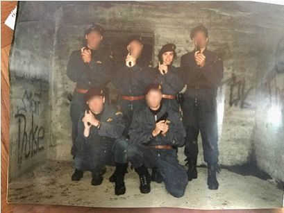
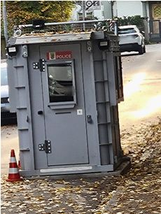

+++
title = "Polizeiberuf, ein Stressfaktor?"
date = "2022-12-01"
draft = false
pinned = false
image = "1.jpg"
description = "Wie stressig ist der Polizeiberuf wirklich? Wir haben uns mit dem Beruf und seinen Arbeitszeiten beschäftig. Dabei haben wir einen Einblick in einen Tag zwischen zwei Nachtschichten bekommen und ein Interview mit der Polizistin Marie-Luise Kilchör geführt."
+++

Die heute 51-jährige Marie-Luise Kilchör hat im Jahr 1995 die Polizeischule im Ausbildungszentrum der Kantonspolizei Bern in Ittigen abgeschlossen. Seither arbeitet sie in verschiedenen Positionen für die Polizei. Nach 4 Jahren Uniform Polizei wechselte sie zur Kriminalpolizei Bern. Aktuell arbeitet sie bei der Fedpol in der SIRENE Schweiz als Fahndungsspezialistin im Schichtbetrieb.  SIRENE steht für “Supplementary Information Request at the National Entry”. Die Fahndungsspezialisten und Fahndungsspezialistinnen beschäftigen sich mit der Personen- und Sachfahndung im Bereich der internationalen Fahndungen.

## Was dürfen Polizisten und Polizistinnen im Alltag

### Wie stressig ist der Polizeiberuf wirklich? Wir haben uns mit dem Beruf und seinen Arbeitszeiten beschäftig. Dabei haben wir einen Einblick in einen Tag zwischen zwei Nachtschichten bekommen und ein Interview mit der Polizistin Marie-Luise Kilchör geführt.

###### Eine Reportage von Carolina Schüpbach und Sharelle Kilchör.

> „Die Gesetze sind einem klar."
>
> \-Marie-Luise Kilchör

Grundsätzlich unterliegen Polizisten und Polizistinnen den gleichen Rechten wie jeder andere Bürger und jede andere Bürgerin. Es gibt jedoch Ausnahmen, wenn es um besondere Situationen geht. Was die Polizei genau darf, ist jedoch kantonal gesetzlich geregelt. So gilt zum Beispiel im Kanton Bern: "Polizeiangehörige sind auch in der dienstfreien Zeit zu polizeilichem Handeln im Kantonsgebiet berechtigt, wenn Verbrechen oder Vergehen oder erhebliche Gefährdungen Anlass dazu geben und im Dienst befindliche Polizeiangehörige nicht innert nützlicher Frist verfügbar sind." Ob Situationen, in denen sie polizeiliches Handeln ausserhalb der Dienstzeit anwenden müssen, oft eintreffen, ist schwer zu beurteilen. Daher haben wir uns bei Marie-Louis Kilchör erkundigt, die schon einige Zeit bei der Polizei arbeitet. Sie antwortet auf die Frage, ob sie bereits solche Situationen erlebt habe: “So direkt kommt mir nichts in den Sinn, aber das hat es schon gegeben.  Bestimmt nichts, das kritisch gewesen wäre, sonst wüsste ich das noch. Aber wie gesagt, fühlt man sich schon angesprochen, wenn man sieht, dass etwas fehlgehen kann.” Neben diesem Gesetz ist es Polizisten und Polizistinnen auch erlaubt, ihre Dienstwaffe mit nach Hause zu nehmen. Dass sie dies dürfen, findet Marie-Louis unbedenklich. Dazu sagt sie: “Nein, ich finde es nicht bedenklich, da sie einen Waffenschein besitzen.... Man hat Schiessausbildungen und immer regelmäßige Übungen. Daher ist man mit der Waffe sehr gut vertraut und weiss, was man darf und was man sein lassen soll. Die Gesetze sind einem klar.”

## Arbeitsalltag in Schichten

Schichtarbeit ist in vielen Bereichen der Berufswelt unverzichtbar, belastet jedoch den Körper und die psychische Gesundheit der Beschäftigten. Das Arbeiten in Schichten hat einige Vor- und Nachteile. Es kann sich stark negativ auf den Körper auswirken, wenn man seinen Schlafrhythmus ständig ändert. Während einer Arbeitswoche in der Schicht kann es schwierig sein, sich mit Freunden und Familie zu treffen, da man oft dann frei hat, wenn andere arbeiten. Das führt dahin, dass sich Personen, die Schicht arbeiten, oftmals einsamer fühlen als jene, die zu Bürozeiten arbeiten. Das Risiko während der Arbeit und auf dem Arbeitsweg Unfälle zu verursachen ist nachgewiesenermassen erhöht, weil die Reaktionszeit und die Wahrnehmung der Schichtarbeitenden beeinträchtigt sind. Das Ausruhen vor und nach den Schichten ist demnach sehr wichtig, damit Körper und Geist regenerieren können.

Einige mögen die Frühschicht am liebsten, andere bevorzugen die Nachtschicht, die beliebteste Schicht sei jedoch die Spätschicht, erklärte uns Marie-Luise, die selbst bei der Polizei im Schichtbetrieb arbeitet. Die Spätschicht habe den Vorteil, dass man am Morgen frei habe. Diesen freien Morgen könne frei gestaltet und genutzt werden. Zum Beispiel Terminen nachgehen, Hausarbeiten erledigen oder sich ausruhen.  

Es ist stets ein spannender Augenblick, wenn der Arbeitsplan für den bevorstehenden Monat freigegeben wird. «Der Dienstplan kann nicht mitbestimmt werden. Jedoch haben wir zwei bis drei Freitage pro Monat, die wir wünschen können», erklärt uns Marie-Luise. Zusätzlich zu den 2-3 Freitagen monatlich, die nach Wunsch planbar sind, besteht auch die Möglichkeit, Dienstabtausche mit anderen vom Kommissariat zu organisieren.

## Arbeiten in Nachtschicht

«Wenn man in der Freizeit noch Sport ausübt oder sich mit Freunden trifft, ist man nicht selten zu wenig erholt für das Arbeiten in der darauffolgenden Woche». Auch wird an anderen vorbeigelebt, wenn man seinen Ruhetag nach Nachtschichten zuhause im Bett verbringt. Carolina Schüpbach und Sharelle Kilchör haben miterlebt, wie sich Marie-Luise auf ihre Nachtschichten vorbereitet und wie sie ihren Ruhetag gestaltet. Für den Tag vor einer Nachtschicht oder für die Zeit zwischen mehreren Nachtschichten hat sie sich kleine Tricks angeeignet, um für ihre Nachtschichten besser gewappnet zu sein. So erzählt sie uns, sie gestalte ihren Tag stets ruhig, um keine Termine einhalten zu müssen. Oft mache sie am Morgen etwas Haushalt oder erledige Gartenarbeiten. Stress und aufwühlende Situationen vermeide sie, da sie sich schon auf den Nachmittagsschlaf vorbereite. Wir essen gemeinsam zu Mittag. Es gibt Pasta, viele Kohlenhydrate, damit sie der Zuckerspiegel ermüde und sie für 1-2 Stunden schlafen könne, erklärt sie uns. Dies sei einer ihrer Tricks. Auch wir spüren, dass wir uns nach einem üppigen Pasta-Teller gerne kurz hinlegen möchten. Bevor sie sich ins Bett begibt, erzählt sie uns noch, sie habe manchmal Mühe mit dem Einschlafen, weil ihr bewusst sei, wie wichtig der Nachmittagsschlaf für sie sei. Später, sie ist inzwischen wieder aufgestanden, um arbeiten zu gehen, essen wir noch gemeinsam das Nachtessen. Für uns ungewöhnlich spät, für sie aber normal vor einer Nachtschicht. Uns fällt auf, dass wir dieses Mal fast keine Kohlenhydrate essen. Marie-Luise isst sogar nur leichten Salat. Für uns gibt es noch ein Stück Brot dazu. „Kohlenhydrate machen mich oftmals sehr müde, daher kann ich durch mein Essverhalten sehr gut steuern, wann ich müde sein soll“, erzählt sie uns. Während der Nachtschicht sei sie selten müde, erzählt sie uns, aber die Tage darauf benötige sie dringend genügend Schlaf und Ruhe, um sich zu erholen. Sie versucht, an einem Ruhetag mindestens 5 Stunden zu schlafen, damit sie nicht komplett aus ihrem Schlafrhythmus fällt. Nach dem Abendessen verabschieden wir uns von Marie-Luise und bedanken uns für den Einblick in ihren Alltag.

## Dienst an Feiertagen und Wochenenden

Das Arbeiten an Feiertagen und an Wochenenden ist ziemlich beliebt, was uns doch erstaunt. Fast allein unterwegs zu sein auf der Skipiste oder beim Wandern sei für viele Mitarbeitenden motivierend. Das Arbeiten in Schichten lässt diese Flexibilität zu, da man regelmässig auch am Wochenende arbeitet, dafür unter der Woche freibekommt. Am Wochenende zu arbeiten, hat demnach nachvollziehbare Vorteile. Wochenenden und Feiertage bieten zudem einen zusätzlichen, attraktiven finanziellen Zustupf zum Grundeinkommen. Weihnachten oder andere Feiertage mit Familie zu verbringen, sei auf Wunsch oft möglich und wird von den Schichtarbeitenden geschätzt. Für alleinerziehende Elternteile könne es ab und an schwierig werden, die ihnen zugeteilten Wochenendschichten zu tätigen, jedoch werde immer eine Lösung gefunden.

## Erlebnisse aus dem Beruf verarbeiten

> „Man muss vor Leute hin stehen können.“
>
> \-Marie-Luise Kilchör

Um bei der Polizei arbeiten zu können, ist eine starke Psyche eine wichtige Voraussetzung. Im Berufsalltag eines Polizisten oder einer Polizistin kommt es regelmässig zu einschneidenden Erlebnissen.

 «Wenn Jugendliche vermisst werden, sei es, weil diese von zuhause oder aus einem Heim entlaufen sind und dazu auch noch suizidal sind, dann beschäftigt mich das durchaus auch zuhause noch».

Sie sagt uns, dass sie solche Fälle manchmal noch weiterverfolgt, um sich zu versichern, dass alles im Guten endet. Nicht selten seien die bearbeiteten Fälle auf der Arbeit während den Pausen noch ein Gesprächsthema. Es gibt dazu Studien, die belegen, dass Polizisten pro Woche bis zu drei traumatisierenden Ereignissen gegenüberstehen. Dabei geht es nicht nur um schockierende Bilder, die nicht mehr vergessen gehen, sondern auch um traumatisierende Schicksalsschläge oder Tathergänge, bei denen bspw. Opfer nie aufgefunden werden. Solche Situationen erleben Menschen, die nicht in diesem Bereich arbeiten, viel weniger. Dadurch ist die psychische Belastung dieses Berufes hoch.  Die eigenen Emotionen im Griff zu halten, ist äusserst schwierig und doch müssen die Polizistinnen und Polizisten immer einen kühlen Kopf bewahren. Daher ist der Beruf nicht für jeden bewältigbar und es steht oftmals auch ein Polizeipsychologe mit therapeutischer Ausbildung zur Verfügung. Viele Polizisten haben jedoch vorerst Mühe, diesen aufzusuchen, da die Hemmschwelle, sich Hilfe zu holen, gross sein kann.

Zusätzlich werden an Polizistinnen und Polizisten viele Anforderungen gestellt, mit denen sie jeden Tag aufs Neue konfrontiert werden. Dabei stehen sie nicht nur unter der Beobachtung ihres Chefs oder ihrer Chefin, sondern auch unter den kritischen Blicken der Öffentlichkeit. Dabei muss man genug selbstsicher sein, erklärt Marie-Luise. Genauer sagt sie: “Ja, Selbstbewusstsein muss man schon haben. Man muss vor Leute hinstehen können und da es ja heißt, die Polizei dein Freund und Helfer, muss man helfen können. Man sollte auch eine gewisse Autorität ausstrahlen, damit man Sicherheit gibt, wenn die Situation diese erfordert. ”Diese täglichen Konfrontationen stellen für Polizistinnen und Polizisten, die ein Erlebnis noch nicht verarbeitet haben, extreme Stresssituationen dar. Sie sind gezwungen, mit diesen herausfordernden Gegebenheiten umgehen zu können, um handlungs- und entscheidungsfähig zu bleiben. Sofern das Erlebnis nicht verarbeitet werden kann, kann sich das traumatische Erlebnis zu einer posttraumatischen Belastungsstörung entwickeln. Diese Erkrankung kann den gesamten Charakter, die Leistungsfähigkeit und die Zurechnungsfähigkeit negativ beeinflussen. Diese posttraumatischen Belastungsstörungen können das zuvor gewesene Paradigma, das Weltbild von Gut und Böse kippen. Der englische Begriff *stress disorder* beschreibt diese Erkrankung noch etwas vorstellbarer.

Unsere Recherchen im Arbeitsfeld der Polizei- und Schichtarbeit haben ergeben, dass die Dienstleistenden grossen psychischen und physischen Herausforderungen gegenüberstehen. Diese können je nach Persönlichkeit, verschieden verarbeitet werden und haben somit auch einen unterschiedlich starken Einfluss auf die Gesundheit und den Stresspegel einer Person haben. Polizisten und Polizistinnen müssen daher zusätzlich Methoden finden, mit diesen Herausforderungen umzugehen, um ihr Pensionsalter bei guter Gesundheit zu erreichen.